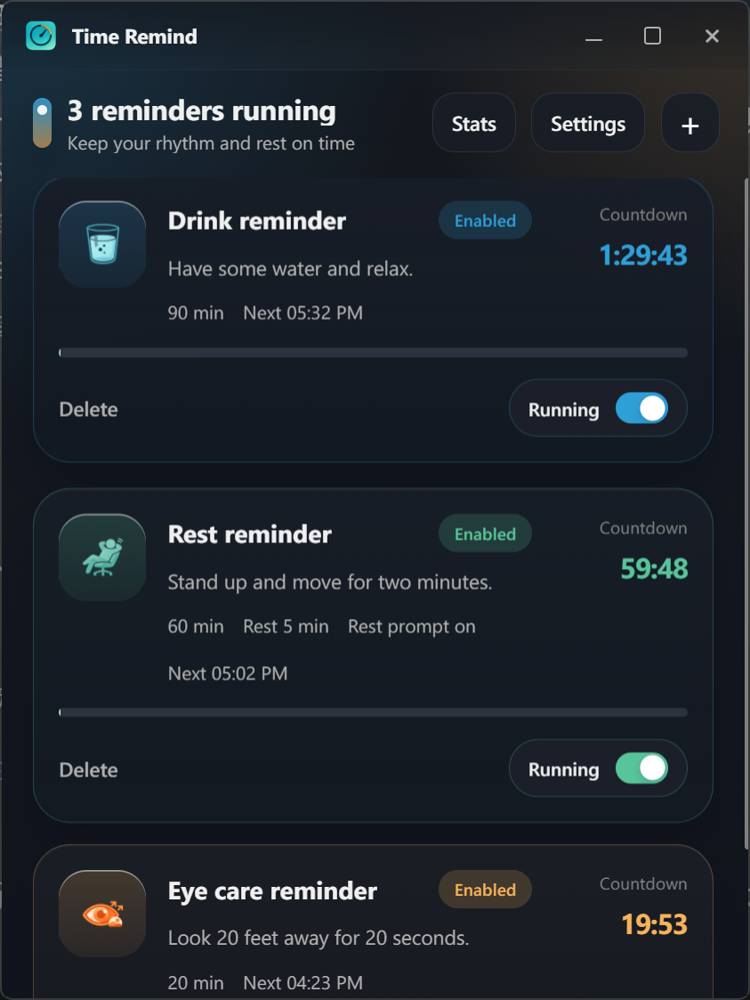
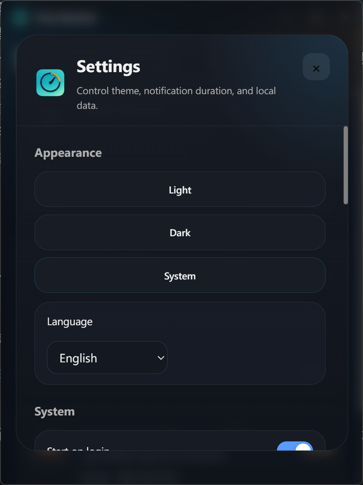

# Time Remind

[简体中文](README.zh-CN.md)

Time Remind is a lightweight desktop wellness reminder app for people who spend long hours at a computer. It helps you keep a steady rhythm for drinking water, taking short breaks, and resting your eyes.





## Platform Status

| Platform | Status | Notes |
|----------|--------|-------|
| Windows | Supported and verified | The current release package targets Windows 10/11. |
| macOS | Planned, not verified | No public installer is released yet. Tray, autostart, lock detection, and fullscreen behavior still need real-device validation. |
| Linux | Planned, not verified | No public installer is released yet. Tray compatibility and desktop-environment behavior still need validation. |

Windows is the verified release platform. macOS and Linux are planned targets and should not be treated as officially supported until package builds, platform capability fallback, and real-device validation are complete.

## Features

- Default drink, rest, and eye care reminders.
- Custom reminders with configurable name, message, interval, and action countdown.
- Complete, postpone, skip, and timeout handling in the reminder popup.
- Do Not Disturb schedule.
- Windows fullscreen detection for presentations and games.
- Start on login and silent startup on supported platforms.
- System tray menu and background running.
- Daily stats, trend chart, and streak display.
- Configuration export and import.
- Light, dark, and system theme modes.
- Multilingual interface.

## Install

Download an installer from the [latest GitHub release](https://github.com/EthanHannn/time-remind/releases/latest).

Recommended assets:

- Windows: `Time Remind_0.1.1_x64-setup.exe`

macOS and Linux installers are not published yet. The Windows installer is not code-signed yet, so Windows may show an unknown publisher warning.

## Build From Source

Requirements:

- Node.js 20 or later
- pnpm 9 or later
- Rust stable
- Windows: Visual Studio Build Tools 2022
- macOS: Xcode Command Line Tools
- Linux: WebKitGTK, GTK 3, AppIndicator, librsvg, and related distribution packages

Common commands:

```powershell
pnpm install
pnpm lint
pnpm test
pnpm build
pnpm tauri dev
```

Package commands:

```powershell
# Windows
pnpm tauri build --bundles nsis

# macOS
pnpm tauri build --bundles app,dmg

# Linux
pnpm tauri build --bundles deb,appimage
```

Expected outputs:

- Windows: `src-tauri/target/release/bundle/nsis/Time Remind_0.1.1_x64-setup.exe`
- macOS: `src-tauri/target/release/bundle/macos/Time Remind.app`, `src-tauri/target/release/bundle/dmg/Time Remind_0.1.1_*.dmg`
- Linux: `src-tauri/target/release/bundle/deb/*.deb`, `src-tauri/target/release/bundle/appimage/*.AppImage`

Only the Windows NSIS installer is currently part of the verified release flow. macOS and Linux outputs are build targets for future validation.

## Data And Privacy

- All data is stored locally.
- No account is required.
- No network service is required for reminder data.
- Reminders, settings, logs, and import/export data are processed locally.

Use the export feature before reinstalling the system or moving to another device.

## Known Limitations

- Current version is `0.1.1 Beta`.
- Windows installer is not code-signed.
- macOS and Linux installers are not published yet.
- macOS signing and notarization are not complete.
- Linux tray behavior varies by desktop environment.
- Non-Windows lock detection, fullscreen detection, tray behavior, and autostart still need real-device validation.
- Local custom audio files and fullscreen overlay mode are not included yet.

## Contributing

Issues and feedback are welcome. macOS and Linux support work is tracked as planned validation rather than an officially supported release.

## Changelog

See [CHANGELOG.md](CHANGELOG.md).
